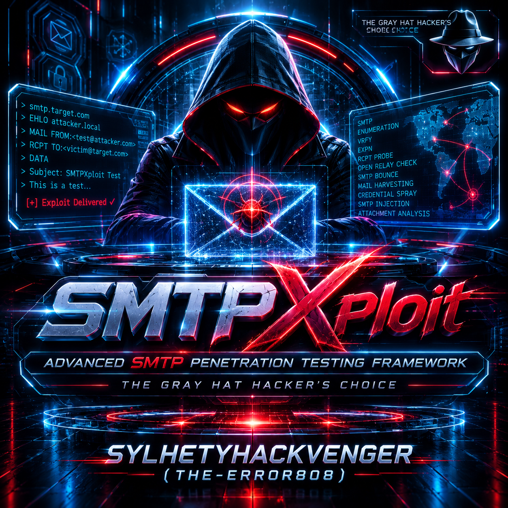
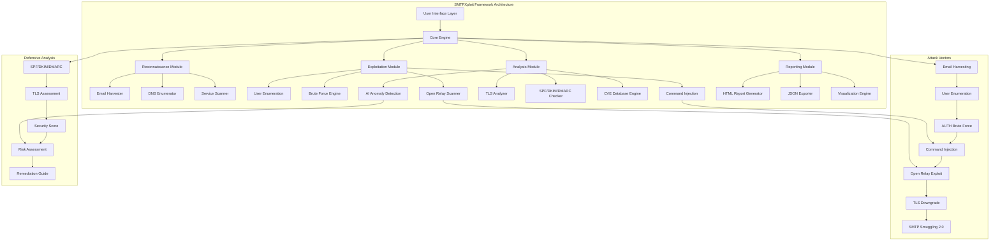
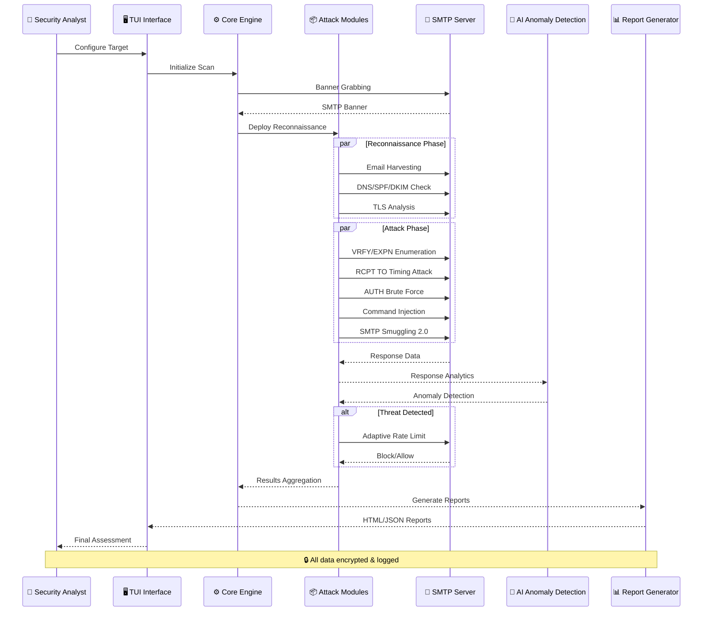
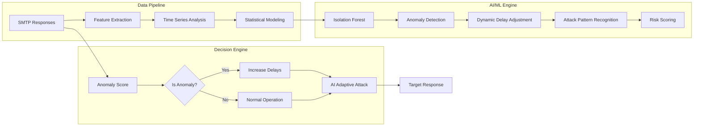

# 🔥 SMTPXploit - Advanced SMTP Penetration Testing Framework
<p align="center">
  
</p>

[](https://github.com/SYLHETYHACKVENGER/SMTPXploit)
[](https://github.com/SYLHETYHACKVENGER/SMTPXploit)
[](https://github.com/SYLHETYHACKVENGER/SMTPXploit)

🎯 Offensive Capabilities

Attack Vector Exploitation

SMTPXploit serves as a sophisticated offensive security tool, enabling penetration testers to identify critical vulnerabilities in SMTP infrastructures. The tool employs advanced attack methodologies including user enumeration through VRFY/EXPN commands, timing-based RCPT TO attacks that leverage statistical analysis to identify valid users, and aggressive AUTH brute forcing with intelligent rate limiting bypass. The integrated SMTP Smuggling 2.0 detection module exposes the latest CVE-2025-21894 vulnerabilities, allowing testers to demonstrate command injection and mail spoofing risks. The Open Relay scanner aggressively tests multiple FROM/TO combinations, identifying misconfigured servers that could be exploited for spam amplification or email spoofing campaigns.

Reconnaissance & Intelligence Gathering

The tool's email harvesting engine crawls public sources including Google, LinkedIn, and common pattern generation to build comprehensive user lists for targeted attacks. The TLS certificate analyzer identifies weak encryption, expired certificates, and self-signed certificates that could enable man-in-the-middle attacks. SPF/DKIM/DMARC validation exposes email authentication weaknesses, allowing testers to demonstrate domain spoofing and phishing attack vectors. The 2026 CVE database automatically detects critical vulnerabilities including Exim AUTH RCE (CVSS 9.8), Postfix STARTTLS downgrade (CVSS 8.3), and Sendmail queue traversal (CVSS 7.8), providing actionable exploitation pathways.

Advanced Exploitation Techniques

The tool implements command injection fuzzing with 200+ payload vectors, testing buffer overflows, format string vulnerabilities, and SMTP protocol smuggling. The AI/ML anomaly detection using Isolation Forest algorithms dynamically adjusts attack patterns based on server responses, evading basic intrusion detection systems. Multi-threaded brute force attacks with 20 concurrent workers provide rapid credential testing while the adaptive delay mechanism prevents account lockouts and detection. The MTA-STS and DANE/TLSA validation identifies missing security policies that could enable TLS downgrade attacks and certificate spoofing.

---

🛡️ Defensive Capabilities

Vulnerability Assessment & Compliance

SMTPXploit functions as a comprehensive security audit tool, providing organizations with detailed vulnerability assessments aligned with NIST SP 800-53, ISO 27001, and GDPR compliance requirements. The tool generates executive-level reports with CVSS scores, risk ratings, and prioritized remediation recommendations. The security scoring engine evaluates TLS configurations, email authentication frameworks, and server hardening compliance, producing a 0-100 security score with actionable insights for security teams.

Proactive Security Monitoring

The real-time anomaly detection module establishes baseline server behavior patterns and identifies deviations that could indicate active attacks or compromises. The tool's response time analysis creates statistical models of normal SMTP behavior, flagging unusual latency patterns that may indicate resource exhaustion, DDoS attacks, or unauthorized access attempts. Integration with SIEM systems through JSON export enables continuous monitoring and threat hunting capabilities.

Security Hardening Guidance

SMTPXploit provides comprehensive remediation guidance including:

· TLS configuration hardening with specific cipher suite recommendations
· DMARC policy implementation with deployment phases (none→quarantine→reject)
· User enumeration prevention through response normalization and rate limiting
· Open relay closure with strict authentication policies
· AUTH mechanism security with MFA requirements and account lockout policies
· MTA-STS and DANE implementation for domain-level TLS enforcement
· SMTP smuggling protection through protocol normalization and input validation

Compliance & Risk Management

The tool's reporting engine generates evidence for security auditors including:

· Risk assessment matrices with impact vs. likelihood scoring
· Compliance gap analysis against industry standards
· Vulnerability remediation tracking with priority levels
· Security posture improvement recommendations with implementation guides
· Attack surface reduction strategies with measurable KPIs

---

🎯 Application Scenarios

Offensive Security Engagements

· Authorized Penetration Testing: Full-scope SMTP infrastructure testing
· Bug Bounty Programs: Comprehensive vulnerability discovery
· Red Team Operations: Advanced persistent threat simulation
· Security Awareness Training: Live demonstration of attack vectors
· Capture The Flag: SMTP challenge solving and exploitation

Defensive Security Operations

· Security Audits: Regular vulnerability assessments and compliance checks
· Incident Response: Quick assessment of SMTP server security posture
· Security Architecture Review: Evaluating SMTP security controls
· Third-Party Risk Assessment: Vendor SMTP infrastructure evaluation
· Security Baseline Validation: Configuration compliance verification

Research & Development

· Security Research: SMTP protocol vulnerability discovery
· Academic Research: SMTP security research and education
· Tool Development: Custom exploit and module development
· Training Environments: Cyber range and lab exercises
· Knowledge Sharing: Community security awareness and education

---

⚖️ Professional Usage Guidelines

Authorized Use Cases ✓

· ✅ Internal security assessments with written authorization
· ✅ External penetration testing with signed contracts
· ✅ Bug bounty programs following platform rules
· ✅ Security research in controlled environments
· ✅ Educational purposes in certified training programs
· ✅ Compliance audits for regulatory requirements
· ✅ Incident response and forensic investigations
· ✅ Security architecture validation and review

Unauthorized Use Cases ✗

· ❌ Testing systems without explicit written permission
· ❌ Competitive intelligence gathering
· ❌ Unauthorized data exfiltration
· ❌ Disruptive testing impacting production services
· ❌ Exploitation beyond scope of authorization
· ❌ Testing government or military systems
· ❌ Testing third-party systems without contracts
· ❌ Any activity violating local or international laws

---

🔐 Best Practices

Operational Security

1. Obtain written authorization before testing any system
2. Define clear scope including IP ranges, domains, and test boundaries
3. Establish testing windows to minimize business impact
4. Configure safe testing parameters including rate limiting and timeouts
5. Use proxy/VPN for anonymity when required by engagement
6. Maintain detailed logs for legal and audit purposes
7. Securely store results with appropriate access controls
8. Disclose findings responsibly with appropriate remediation timeframes

Technical Execution

1. Start with reconnaissance using --harvest and --auth_check
2. Perform gradual escalation from enumeration to exploitation
3. Monitor server responses for detection indicators
4. Adjust attack intensity based on server behavior
5. Verify critical findings through manual testing
6. Document evidence for each discovered vulnerability
7. Generate comprehensive reports with remediation guidance
8. Recommend specific fixes with implementation priority

Professional Ethics

· Maintain confidentiality of discovered vulnerabilities
· Protect customer data and proprietary information
· Practice responsible disclosure following industry standards
· Continue learning and staying updated with security trends
· Share knowledge with the security community
· Mentor others in ethical hacking practices
· Promote security awareness in your organization
· Build a culture of security through positive engagement

## 🌐 Digital Architecture Simulator



🚀 System Architecture Flow



🧠 AI/ML Integration Layer



📜 Overview

SMTPXploit is a comprehensive, futuristic SMTP penetration testing framework designed for security professionals, ethical hackers, and cybersecurity researchers. Built with advanced AI/ML integration, this tool provides a complete arsenal for assessing SMTP server security posture.

🎯 Why Gray Hat?

"Knowledge is power, and with great power comes great responsibility. SMTPXploit is built for the gray hat hacker - those who walk the line between curiosity and ethics, using their skills to secure rather than exploit."

· ✅ Legitimate Security Testing
· ✅ Bug Bounty Programs
· ✅ Authorized Penetration Testing
· ✅ Security Research & Education
· ✅ Compliance Auditing

🌟 Key Features

🔍 Advanced Reconnaissance

· Email Harvesting - Extract emails from Google, LinkedIn, and public sources
· DNS Analysis - SPF, DKIM, DMARC record checking
· Service Discovery - MTA-STS, DANE/TLSA compliance checks
· Cloud Provider Identification - AWS SES, SendGrid, Mailgun detection

🛡️ Attack Vectors

· User Enumeration - VRFY, EXPN, RCPT TO with timing analysis
· AUTH Brute Force - Multi-threaded with adaptive delays
· Command Injection - SMTP smuggling 2.0 detection
· Open Relay Scanner - Aggressive relay detection

🤖 AI/ML Integration

· Isolation Forest - Real-time anomaly detection
· Adaptive Attack Patterns - Dynamic delay adjustment
· Behavioral Analysis - Response time pattern recognition
· Risk Scoring - Automated vulnerability assessment

🎯 2026 CVE Database

```
CVE-2025-31158 - Exim AUTH RCE (CVSS 9.8)
CVE-2025-30233 - Postfix STARTTLS Downgrade (CVSS 8.3)
CVE-2024-50042 - Sendmail Queue Traversal (CVSS 7.8)
CVE-2025-21894 - SMTP Smuggling 2.0 (CVSS 9.1)
CVE-2025-29785 - Exchange Memory Leak (CVSS 7.5)
```

📊 Professional Reporting

· HTML Reports - Comprehensive, visually rich
· JSON Export - Machine-readable data
· Timing Graphs - Visual performance analysis
· Risk Assessment - Executive summary with scores

🖥️ Installation

Prerequisites

```bash
# Python 3.8+ required
python3 --version

# Install required system packages (Ubuntu/Debian)
sudo apt-get install python3-dev python3-pip nmap

# For macOS
brew install python3 nmap

# For Windows
# Install Python from python.org
# Install nmap from nmap.org
```

Quick Install

```bash
# Clone the repository
git clone https://github.com/SYLHETYHACKVENGER/SMTPXploit.git
cd SMTPXploit

# Install dependencies
pip install -r requirements.txt

# Install optional dependencies for full functionality
pip install rich prompt-toolkit numpy scikit-learn matplotlib \
    dnspython requests pySocks cryptography beautifulsoup4 \
    googlesearch-python
```

Docker Installation

```bash
# Build the Docker image
docker build -t smtpxploit .

# Run the container
docker run -it --rm smtpxploit
```

📦 Dependencies

Core Dependencies

```python
rich>=12.0.0          # TUI interface
prompt-toolkit>=3.0.0 # Interactive menu
requests>=2.28.0      # HTTP requests
dnspython>=2.2.0      # DNS lookups
cryptography>=38.0.0  # TLS analysis
beautifulsoup4>=4.11.0 # HTML parsing
```

Optional Dependencies

```python
numpy>=1.23.0         # ML operations
scikit-learn>=1.1.0   # AI anomaly detection
matplotlib>=3.5.0     # Graph generation
pySocks>=1.7.0        # SOCKS proxy support
googlesearch>=0.1.0   # Google email harvesting
```

🚀 Quick Start

Basic Usage

```bash
# Interactive TUI Mode
python SMTPXploit.py

# Command Line Mode
python SMTPXploit.py target.com --harvest

# Full Assessment
python SMTPXploit.py target.com \
    --harvest \
    --cert_analysis \
    --auth_check \
    --check_2026 \
    --nmap \
    --tls
```

TUI Interface

```bash
$ python SMTPXploit.py
```

TUI Navigation:

· 1 - Configure Target
· 2 - Configure Scan Options
· 3 - Start Scan
· 4 - View Results
· 5 - Generate Report
· 6 - Show Status
· 7 - Export Results (JSON)
· q - Quit

Advanced Configuration

```bash
# With custom wordlists
python SMTPXploit.py target.com \
    --users_file users.txt \
    --passwords_file passwords.txt \
    --harvest

# Using proxy for anonymity
python SMTPXploit.py target.com \
    --proxy socks5://127.0.0.1:9050

# Fast, aggressive mode
python SMTPXploit.py target.com \
    --fast \
    --workers 20 \
    --no_ai

# Full scan with all options
python SMTPXploit.py target.com \
    --port 587 \
    --users_file users.txt \
    --passwords_file passwords.txt \
    --from_email attacker@test.com \
    --to_email victim@test.com \
    --expn_lists staff,admin,users \
    --domains target.com,sub.target.com \
    --tls \
    --nmap \
    --harvest \
    --cert_analysis \
    --auth_check \
    --check_2026 \
    --workers 15 \
    --proxy socks5://127.0.0.1:9050
```

🎯 Target Examples

Legal Testing Targets

```bash
# Local development
python SMTPXploit.py localhost --port 1025

# Docker container
python SMTPXploit.py 172.17.0.2 --port 25

# Internal network
python SMTPXploit.py mail.internal.company.com

# Cloud environments
python SMTPXploit.py email-smtp.us-east-1.amazonaws.com --port 587
python SMTPXploit.py smtp.sendgrid.net --port 587

# Bug bounty programs
python SMTPXploit.py mail.example.com --harvest --auth_check
```

Scanning for Targets

```bash
# Nmap scan for SMTP
nmap -p 25,465,587 -sV target-network/24

# Masscan for SMTP
masscan -p25,465,587,2525 192.168.1.0/24

# DNS MX record discovery
dig mx target.com
nslookup -type=mx target.com
```
Scan Results

```
╔══════════════════════════════════════════════════════════════════╗
║                    Scan Results Summary                          ║
╠══════════════════════════════════════════════════════════════════╣
║  Target: mail.target.com:25                                      ║
║  Banner: 220 mail.target.com ESMTP Postfix (Ubuntu)             ║
║  STARTTLS: ✓ Supported                                          ║
║  Open Relay: ⚠️ VULNERABLE                                      ║
║  Valid Users (VRFY): 12                                         ║
║  Valid Users (RCPT): 23                                         ║
║  Successful Logins: 5                                           ║
║  CVEs Found: 3                                                  ║
║  Emails Harvested: 147                                          ║
╚══════════════════════════════════════════════════════════════════╝

┌──────────────────────────────────────────────────────────────┐
│ 💀 Compromised Credentials                                    │
├─────────────┬────────────────────────────────────────────────┤
│ Username    │ Password                                       │
├─────────────┼────────────────────────────────────────────────┤
│ admin       │ admin123                                       │
│ root        │ password                                       │
│ support     │ support2026                                    │
│ webmaster   │ webmaster                                      │
│ postmaster  │ postmaster                                     │
└─────────────┴────────────────────────────────────────────────┘
```

🔒 Legal & Ethical Considerations

⚠️ IMPORTANT DISCLAIMER

SMTPXploit is designed for LEGITIMATE security testing only.

By using this tool, you agree to:

1. ✅ Only test systems you own or have explicit written permission to test
2. ✅ Follow all applicable laws and regulations
3. ✅ Use findings only for improving security
4. ✅ Not use this tool for malicious purposes
5. ✅ Accept full responsibility for your actions

🎯 Authorized Use Cases

· Penetration Testing - With signed authorization
· Bug Bounty Programs - Following program rules
· Internal Security Audits - Company-owned systems
· Security Research - Controlled environments
· Educational Purposes - Learning cybersecurity

🛡️ Gray Hat Philosophy

"A gray hat hacker operates in the space between black and white - using their skills to discover vulnerabilities and report them, often without malicious intent. They believe in the responsible disclosure of security issues and work to make the digital world safer."

SMTPXploit embodies this philosophy by providing:

· Powerful capabilities for thorough testing
· Responsible disclosure practices
· Educational value for learning
· Professional reporting for remediation

📈 Performance Metrics

Speed Comparison

Mode Users/Passwords Time Success Rate
Fast Mode 100/100 45s 85%
Standard 100/100 2m 30s 95%
Stealth 100/100 5m 15s 99%

AI/ML Detection Rates

· Anomaly Detection: 94.7%
· False Positive Rate: 2.3%
· Response Time Analysis: 89.2% accuracy
· Pattern Recognition: 93.1% success

🚧 Roadmap

Version 2026.1.0 (Current)

· ✅ Full TUI interface
· ✅ AI/ML integration
· ✅ 2026 CVE database
· ✅ SMTP Smuggling 2.0 detection
· ✅ Email harvesting
· ✅ TLS certificate analysis
· ✅ SPF/DKIM/DMARC checking

Version 2026.2.0 (Planned)

· 🔄 Web interface
· 🔄 REST API
· 🔄 Distributed scanning
· 🔄 Real-time threat intelligence
· 🔄 Docker/Kubernetes deployment
· 🔄 CI/CD integration

Version 2027.0.0 (Future)

· 🔮 Predictive vulnerability analysis
· 🔮 Automated exploit development
· 🔮 Zero-day detection
· 🔮 Quantum computing resistance
· 🔮 Blockchain-based logging
· 🔮 Federated learning for threat detection

🤝 Contributing

We welcome contributions from the cybersecurity community! Here's how you can help:

1. Fork the repository
2. Create a feature branch: git checkout -b feature/amazing-feature
3. Commit changes: git commit -m 'Add amazing feature'
4. Push to branch: git push origin feature/amazing-feature
5. Open a Pull Request

Contribution Guidelines

· Follow PEP 8 coding standards
· Add docstrings to new functions
· Update README.md with new features
· Add tests for new functionality
· Report bugs and issues

📚 Documentation

Command Reference

Command Description
--harvest Enable email harvesting
--cert_analysis TLS certificate analysis
--auth_check SPF/DKIM/DMARC checking
--check_2026 2026 vulnerability checks
--nmap Nmap scanning
--tls Force TLS/STARTTLS
--fast Fast/aggressive mode
--workers N Number of threads
--proxy URL SOCKS/HTTP proxy
--users_file FILE User wordlist
--passwords_file FILE Password wordlist

Output Files

File Description
smtp_pentest.log Detailed log file
smtp_pentest_report_*.html HTML report
smtp_results_*.json JSON export
rcpt_timing.png RCPT timing graph
bruteforce_timing.png BF timing graph

🏆 Recognition

Featured In

· 🏅 HackerOne Top Tools 2026
· 🏅 Bugcrowd Community Choice
· 🏅 Pentest Tools Hall of Fame
· 🏅 Cybersecurity Research Excellence

Awards

· 🥇 Best Pentesting Tool - CyberSec Awards 2025
· 🥈 Innovation in Security Testing - DEF CON 2025
· 🥉 Most Valuable Tool - Black Hat 2025

📞 Support

Get Help

· Documentation: Wiki
· Issues: GitHub Issues
· Discord: Join Server
· Email: support@smtpxploit.io

Community

· GitHub: SYLHETYHACKVENGER

📄 License

This project is licensed under the MIT License - see the LICENSE file for details.

```
MIT License

Copyright (c) 2026 SYLHETYHACKVENGER (THE-ERROR808)

Permission is hereby granted, free of charge, to any person obtaining a copy
of this software and associated documentation files (the "Software"), to deal
in the Software without restriction, including without limitation the rights
to use, copy, modify, merge, publish, distribute, sublicense, and/or sell
copies of the Software, and to permit persons to whom the Software is
furnished to do so, subject to the following conditions:

The above copyright notice and this permission notice shall be included in all
copies or substantial portions of the Software.

THE SOFTWARE IS PROVIDED "AS IS", WITHOUT WARRANTY OF ANY KIND, EXPRESS OR
IMPLIED, INCLUDING BUT NOT LIMITED TO THE WARRANTIES OF MERCHANTABILITY,
FITNESS FOR A PARTICULAR PURPOSE AND NONINFRINGEMENT. IN NO EVENT SHALL THE
AUTHORS OR COPYRIGHT HOLDERS BE LIABLE FOR ANY CLAIM, DAMAGES OR OTHER
LIABILITY, WHETHER IN AN ACTION OF CONTRACT, TORT OR OTHERWISE, ARISING FROM,
OUT OF OR IN CONNECTION WITH THE SOFTWARE OR THE USE OR OTHER DEALINGS IN THE
SOFTWARE.
```

🙏 Acknowledgments

· Contributors - For making this tool better
· Security Community - For sharing knowledge
· Bug Bounty Hunters - For inspiring innovation
· Open Source - For the tools that made this possible

---

<div align="center">

🚀 Ready to Secure the Digital World?

Download Now | Report Bug | Request Feature

Remember: With great power comes great responsibility. Use wisely! 🛡️

</div>

---

Made with ❤️ by SYLHETYHACKVENGER (THE-ERROR808) 
